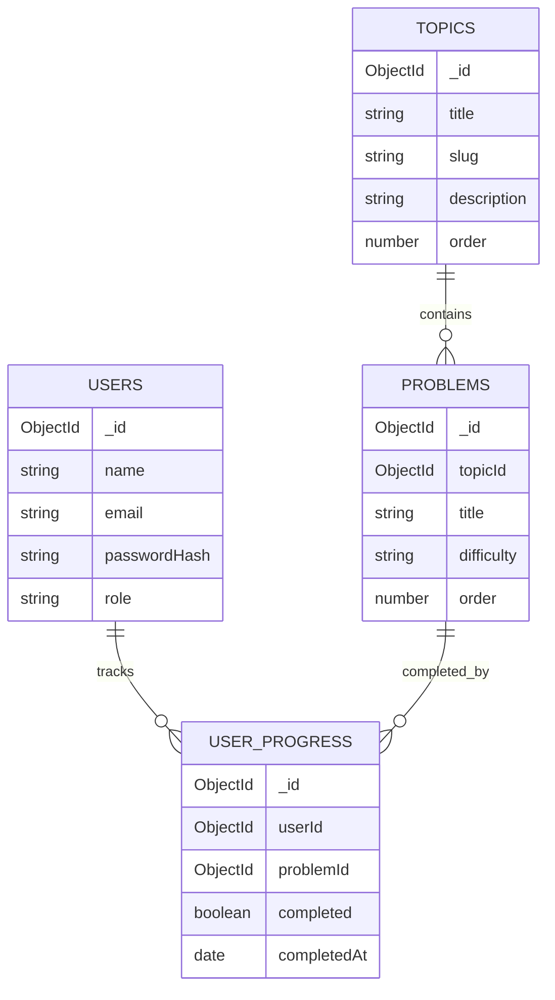

# Database Schema

Database: MongoDB

## users

Stores student accounts.

| Field | Type | Notes |
| --- | --- | --- |
| `_id` | ObjectId | Primary identifier |
| `name` | String | Student name |
| `email` | String | Lowercase, unique |
| `passwordHash` | String | bcrypt hash, never returned by API |
| `role` | String | `student` or `admin` |
| `createdAt` | Date | Managed by Mongoose |
| `updatedAt` | Date | Managed by Mongoose |

Indexes:

- Unique index on `email`

## topics

Stores DSA chapters.

| Field | Type | Notes |
| --- | --- | --- |
| `_id` | ObjectId | Primary identifier |
| `title` | String | Display title |
| `slug` | String | Unique URL/content identifier |
| `description` | String | Short chapter summary |
| `order` | Number | Display order |
| `createdAt` | Date | Managed by Mongoose |
| `updatedAt` | Date | Managed by Mongoose |

Indexes:

- Unique index on `slug`
- Index on `order`

## problems

Stores individual problems under a topic.

| Field | Type | Notes |
| --- | --- | --- |
| `_id` | ObjectId | Primary identifier |
| `topicId` | ObjectId | References `topics._id` |
| `title` | String | Problem title |
| `difficulty` | String | `Easy`, `Medium`, or `Hard` |
| `order` | Number | Display order inside topic |
| `resources.youtube` | String | Tutorial link |
| `resources.practice` | String | LeetCode or Codeforces link |
| `resources.article` | String | Theory/reference article |
| `createdAt` | Date | Managed by Mongoose |
| `updatedAt` | Date | Managed by Mongoose |

Indexes:

- Compound index on `{ topicId: 1, order: 1 }`
- Index on `difficulty`

## user_progress

Stores per-user checkbox state.

| Field | Type | Notes |
| --- | --- | --- |
| `_id` | ObjectId | Primary identifier |
| `userId` | ObjectId | References `users._id` |
| `problemId` | ObjectId | References `problems._id` |
| `completed` | Boolean | Current checkbox state |
| `completedAt` | Date | Date when marked complete |
| `createdAt` | Date | Managed by Mongoose |
| `updatedAt` | Date | Managed by Mongoose |

Indexes:

- Unique compound index on `{ userId: 1, problemId: 1 }`
- Compound index on `{ userId: 1, completed: 1 }`

## Relationships

## Design Notes

- Topics and problems are shared by all users.
- Progress is isolated per user through `user_progress`.
- A unique `{ userId, problemId }` index prevents duplicate progress records.
- Dashboard counts can be computed quickly from indexed progress records.
- For larger production use, aggregate progress summaries could be cached in Redis or stored as denormalized counters.
