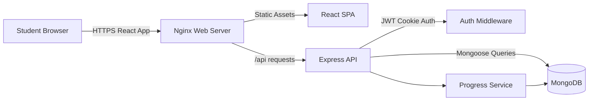
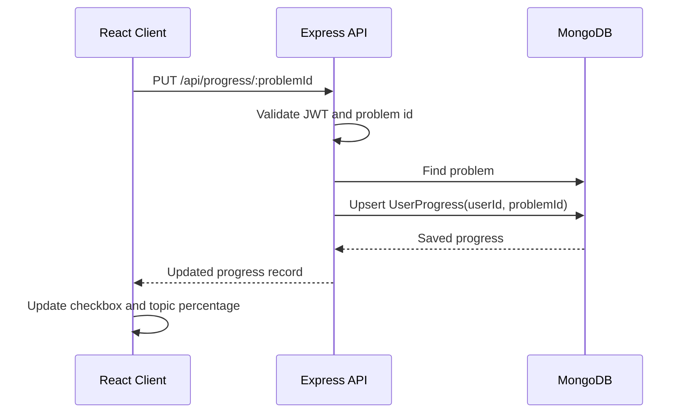
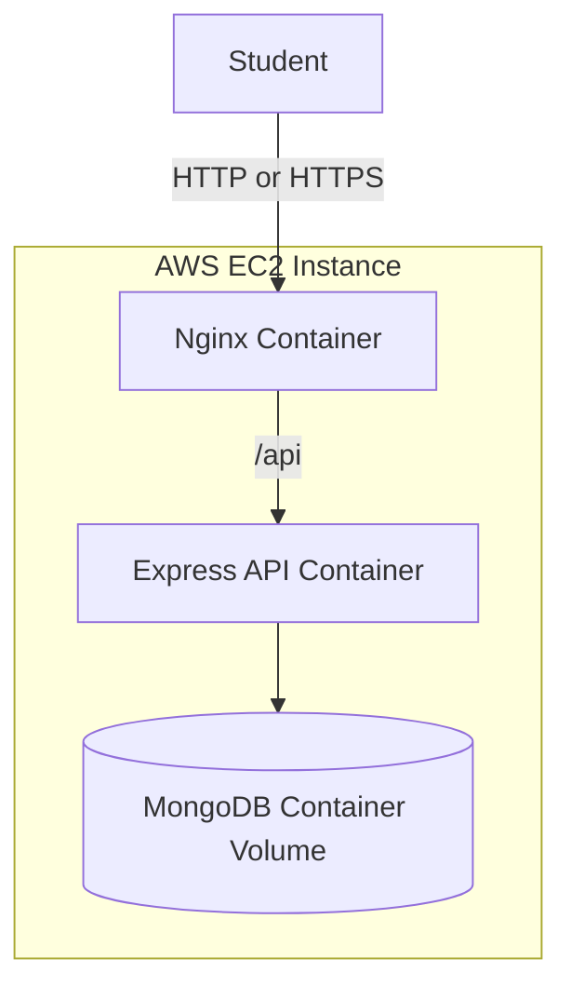

# System Design Document

## Goal

Build a DSA Sheet web application where students can sign up, log in, browse topic-wise problems, access learning resources, mark problems as complete, and resume progress after logging in again.

The design assumes 10k-50k active users with moderate read traffic and frequent small progress updates.

## High Level Architecture

## Request Flow

1. Student opens the deployed URL.
2. Nginx serves the React single-page application.
3. React calls `/api/auth/login` or `/api/auth/register`.
4. Express validates input, checks MongoDB, hashes or compares passwords, and sets a JWT in an httpOnly cookie.
5. Protected API requests pass through auth middleware.
6. React renders the DSA sheet using `/api/topics?includeProblems=true`.
7. Checkbox updates call `/api/progress/:problemId`, which upserts a per-user progress record.

## Authentication Mechanism

- Passwords are hashed with bcrypt before storage.
- JWT contains the `userId` and is signed using `JWT_SECRET`.
- Token is stored in an httpOnly cookie named `dsa_sheet_token`.
- API middleware validates the token and loads the user for protected routes.
- Logout clears the auth cookie.

This keeps the frontend from manually storing sensitive tokens in local storage.

## Progress Tracking Data Flow

## Scalability Considerations

For 10k-50k active users:

- Static React assets can be cached by Nginx or moved to S3/CloudFront.
- Express API can run multiple replicas behind an AWS Application Load Balancer.
- JWT auth is stateless, so API replicas do not need shared session storage.
- MongoDB indexes support login, ordered topic/problem reads, and user progress lookups.
- Progress writes are small upserts keyed by `{ userId, problemId }`, which scales well.
- MongoDB Atlas or DocumentDB can replace the local Mongo container for managed backups, scaling, and monitoring.
- Rate limiting is applied to auth routes to reduce brute-force risk.

## Deployment View

## Trade-offs

- Docker Compose on EC2 keeps the deployment simple for the requested 1-3 day delivery window.
- Managed MongoDB would be better for production reliability, but local MongoDB keeps the deployment simple.
- Cookie-based JWT improves browser security compared with local storage.
- Topic/problem content is seeded from code for repeatability; an admin panel can be added later if content must be edited frequently.
